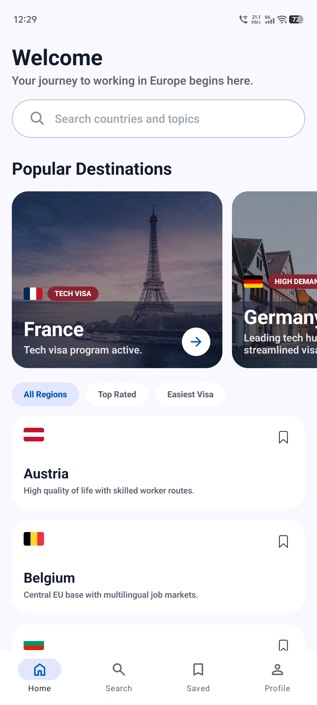
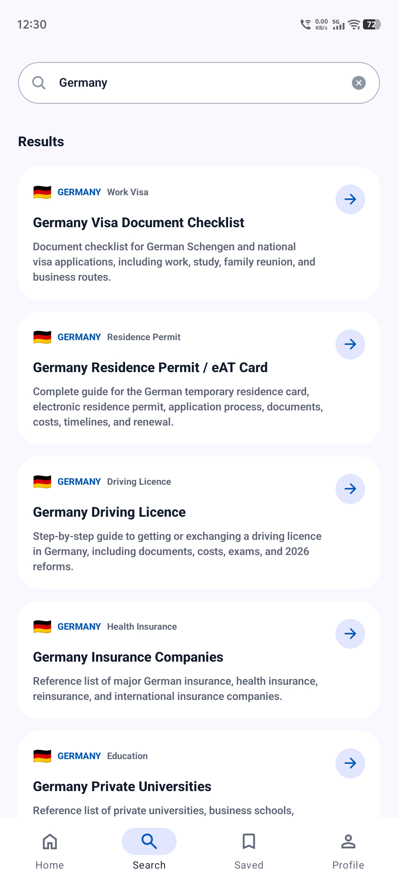
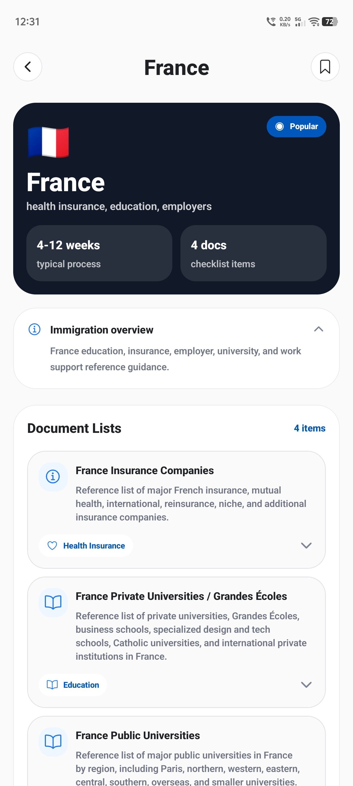
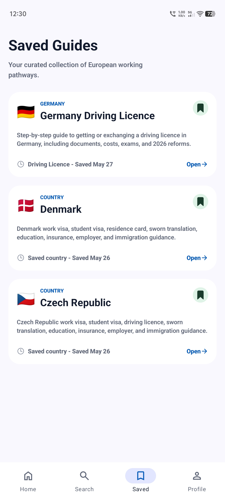
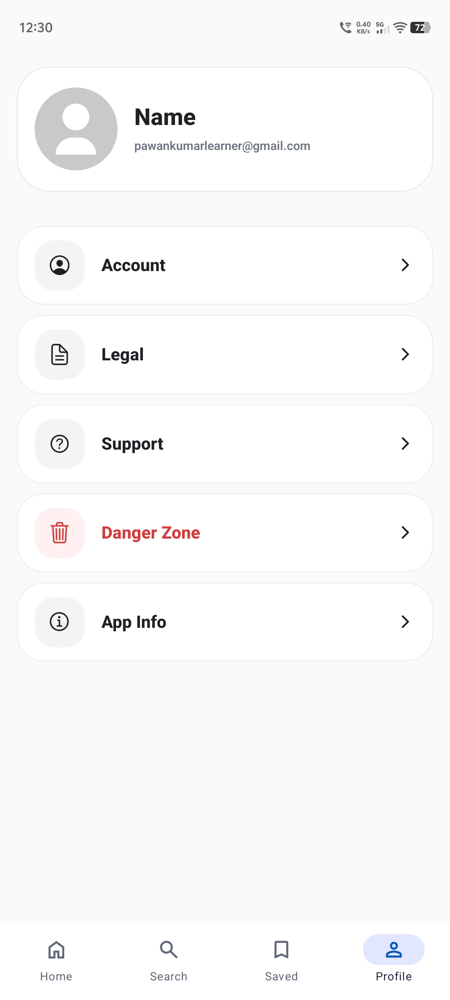

# EU Work Support Web

Professional landing page and payment website for the **EU Work Support** mobile app.

EU Work Support helps people research European work preparation topics from a mobile app: country guidance, document lists, saved references, support, and PRO-only data. This web project exists because payment is handled outside the mobile app. A user requests a website link from the mobile app, creates a website account with the same email, pays securely through Stripe, then returns to the mobile app and logs in with that same email to unlock PRO.

## App Preview

<table>
  <tr>
    <td align="center">
      
      <br />
      <strong>Home</strong>
    </td>
    <td align="center">
      
      <br />
      <strong>Search</strong>
    </td>
    <td align="center">
      
      <br />
      <strong>Country Guides</strong>
    </td>
    <td align="center">
      
      <br />
      <strong>Saved Guides</strong>
    </td>
    <td align="center">
      
      <br />
      <strong>Profile</strong>
    </td>
  </tr>
</table>

## What This Website Does

- Presents a polished landing page for the EU Work Support mobile app.
- Sends a payment/signup link by email using Brevo.
- Creates and authenticates website users with Clerk.
- Relies on the existing Clerk to Supabase webhook to create/update `app_users`.
- Starts a one-time Stripe Checkout payment for PRO lifetime access.
- Verifies Stripe webhooks and upgrades `app_users.user_plan` from `Free` to `PRO`.
- Stores Stripe customer, payment, and webhook event records in Supabase.
- Provides Stripe review-ready legal pages:
  - Privacy Policy
  - Terms & Conditions
  - Refund & Cancellation Policy
  - Contact Us

## User Flow

1. User opens the EU Work Support mobile app.
2. User enters their email to receive a website payment link.
3. Website sends the link through Brevo.
4. User opens the website and creates an account with Clerk.
5. Clerk webhook creates or updates the matching Supabase `app_users` row.
6. User pays a one-time `$50` fee through Stripe Checkout.
7. Stripe webhook verifies the payment and upgrades the user to `PRO`.
8. User returns to the mobile app, logs in with the same email, and accesses PRO content.

## Tech Stack

- **Next.js 16 App Router**
- **React 19**
- **Tailwind CSS 4**
- **Clerk** for authentication
- **Supabase** for user/payment records
- **Stripe** for one-time payment and webhook verification
- **Brevo** for transactional email
- **Zod** for environment and request validation

## Main Routes

| Route | Purpose |
| --- | --- |
| `/` | Landing page |
| `/sign-up` | Clerk sign-up page |
| `/sign-in` | Clerk sign-in page |
| `/checkout` | Protected checkout entry page |
| `/payment/success` | Stripe success return page |
| `/payment/cancel` | Stripe cancel return page |
| `/privacy-policy` | Privacy policy |
| `/terms-and-conditions` | Terms and conditions |
| `/refund-and-cancellation-policy` | Refund and cancellation policy |
| `/contact-us` | Support/contact page |
| `/api/send-payment-link` | Protected Brevo email API |
| `/api/stripe/create-checkout-session` | Protected Stripe Checkout API |
| `/api/webhooks/stripe` | Stripe webhook endpoint |

## Environment Variables

Create `.env.local` from `.env.example` and fill in the required values.

```bash
cp .env.example .env.local
```

Required variables:

```env
NEXT_PUBLIC_CLERK_PUBLISHABLE_KEY=
CLERK_SECRET_KEY=
CLERK_WEBHOOK_SECRET=
NEXT_PUBLIC_CLERK_SIGN_IN_URL=/sign-in
NEXT_PUBLIC_CLERK_SIGN_UP_URL=/sign-up
NEXT_PUBLIC_CLERK_SIGN_IN_FALLBACK_REDIRECT_URL=/checkout
NEXT_PUBLIC_CLERK_SIGN_UP_FALLBACK_REDIRECT_URL=/checkout

BREVO_API_KEY=
BREVO_SENDER_EMAIL=
BREVO_SENDER_NAME=
X_API_KEY=

NEXT_PUBLIC_STRIPE_PUBLISHABLE_KEY=
STRIPE_SECRET_KEY=
STRIPE_WEBHOOK_SECRET=
STRIPE_PRO_PRICE_ID=

NEXT_PUBLIC_SITE_URL=http://localhost:3000
NEXT_PUBLIC_MOBILE_APP_URL=euworksupport://

SUPABASE_URL=
SUPABASE_SERVICE_ROLE_KEY=
```

`X_API_KEY` protects `/api/send-payment-link`. The caller must send it in the request header:

```http
x-api-key: your_api_key_here
```

## Supabase Setup

The SQL for payment-related tables is in [`supabase.md`](supabase.md).

Run it in the Supabase SQL Editor before testing Stripe webhooks. It creates:

- `app_stripe_customers`
- `app_payments`
- `stripe_webhook_events`
- indexes and updated-at triggers

The project expects an existing `public.app_users` table that stores Clerk-linked app users and includes `user_plan`.

## Stripe Setup

1. Create a one-time Stripe Price for EU Work Support PRO.
2. Add the price ID to `STRIPE_PRO_PRICE_ID`.
3. Add your deployed website URLs in Stripe public settings:
   - Privacy Policy
   - Terms & Conditions
   - Refund & Cancellation Policy
   - Contact Us
4. Configure the webhook endpoint:

```text
https://your-domain.com/api/webhooks/stripe
```

Required event types:

- `checkout.session.completed`
- `checkout.session.async_payment_succeeded`
- `checkout.session.async_payment_failed`

## Brevo Email API

Endpoint:

```http
POST /api/send-payment-link
```

Headers:

```http
content-type: application/json
x-api-key: your_api_key_here
```

Body:

```json
{
  "email": "user@example.com",
  "name": "User Name"
}
```

The route validates the API key, validates the email, rate-limits by IP and email, then sends the website sign-up link through Brevo.

## Development

Install dependencies:

```bash
pnpm install
```

Run the development server:

```bash
pnpm run dev
```

Open:

```text
http://localhost:3000
```

Build for production:

```bash
pnpm run build
```

Start the production build:

```bash
pnpm run start
```

## Project Structure

```text
src/app                         App Router pages and route handlers
src/components/auth             Clerk auth layout and appearance
src/components/checkout         Checkout client UI
src/components/landing          Landing page sections
src/components/legal            Legal page renderer
src/components/site             Shared footer
src/constant                    Static testimonial data
src/lib/env.ts                  Environment validation
src/lib/stripe                  Stripe server client
src/lib/supabase                Supabase helpers
public/assets                   Mobile app UI screenshots
public/assets/images            Testimonial user images
```

## Notes

- PRO is a one-time `$50` payment for lifetime access.
- Payment happens on the website, not inside the mobile app.
- Users must use the same email on the website and mobile app.
- Stripe webhooks are the source of truth for upgrading users to `PRO`.
- The payment-link API is protected with `X_API_KEY`.
